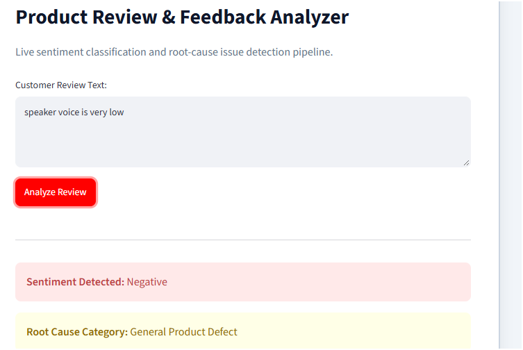

# Customer Feedback & Review Triage System

An end-to-end machine learning system designed to process raw e-commerce customer reviews, classify sentiment polarity, and isolate operational issues from negative feedback.

---

## Web Interface Overview



Live application link: [https://vivek-sentiment-analyzer.streamlit.app]

---

## Overview

E-commerce businesses handle thousands of customer reviews every week. Reading every single comment manually is inefficient, and critical operational complaints regarding battery defects, shipping delays, or damaged packaging often get lost under positive feedback.

This project addresses the problem through a two-tier pipeline:
1. It screens incoming reviews and classifies them as Positive or Negative using an optimized text classification model.
2. If a review is negative, it immediately routes the complaint into operational categories: Hardware and Battery, Shipping and Logistics, Build Quality and Packaging, Pricing and Value, or Customer Support.
3. The results are served through a clean Streamlit dashboard where teams can test and analyze customer reviews in real time.

---

## Performance Summary

During experiments, we compared a standard baseline model against a tuned support vector classifier.

- Baseline Model (Multinomial Naive Bayes): 82.19% accuracy
- Final Model (LinearSVC with tuned hyperparameters): 86.69% accuracy
- Representation: TF-IDF vectorization with unigrams, bigrams, and trigrams alongside sublinear term frequency scaling.

Why LinearSVC performed better:
High-dimensional sparse text data exhibits strong linear separability. By including n-grams up to trigrams and dampening repeated common words with sublinear scaling, LinearSVC separated subtle negative phrases much more reliably than the word-independence assumptions of Naive Bayes.

---

## Tech Stack

- Programming: Python
- Data Processing: Pandas, NumPy, Regular Expressions
- Machine Learning & NLP: Scikit-learn (TfidfVectorizer, LinearSVC, GridSearchCV), NLTK
- Model Serialization: Joblib
- Web Framework: Streamlit
- PDF & Reporting: WeasyPrint
- Deployment: Streamlit Community Cloud

---

## Project Structure

```text
060_Sentiment_analysis/
│
├── app.py                         # Interactive Streamlit application
├── requirements.txt               # Project dependencies
├── best_sentiment_model.pkl       # Serialized tuned LinearSVC model
├── best_tfidf_vectorizer.pkl      # Serialized TF-IDF vectorizer
├── model_training.ipynb           # Data cleaning, EDA, and model training notebook
├── model_card_generator.ipynb     # Notebook to render and generate the PDF model card
├── Project_Report_Model_Card.pdf  # 1-page executive technical project report
├── app_screenshot.png             # Application interface preview
└── README.md                      # Project documentation